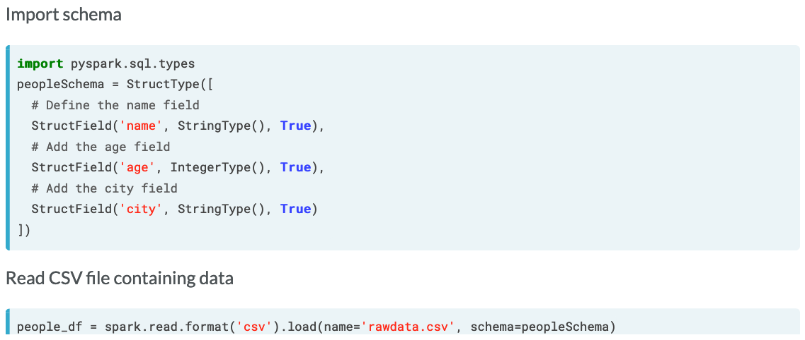
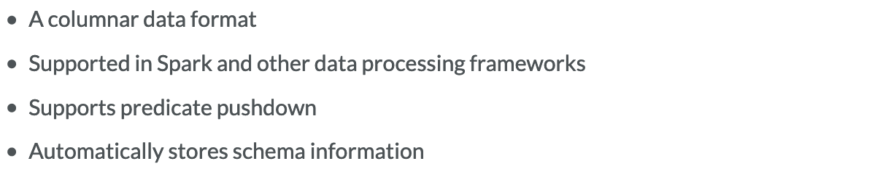
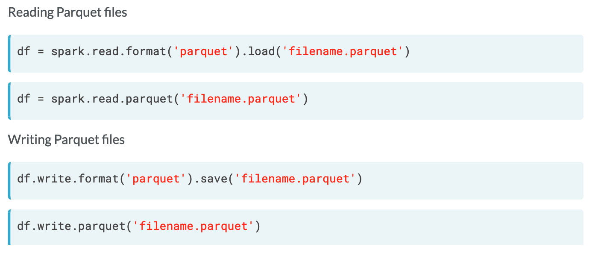
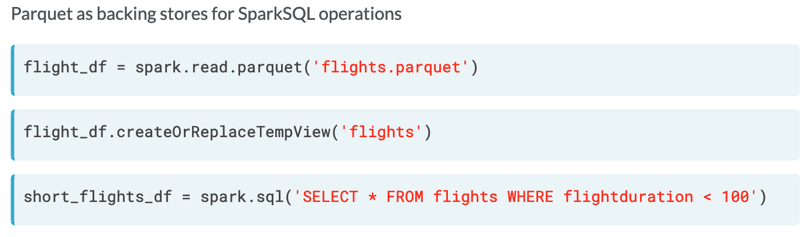
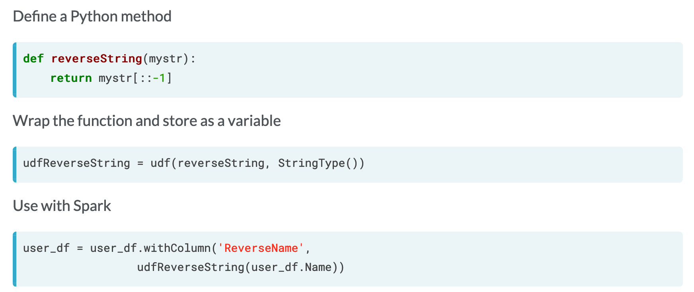
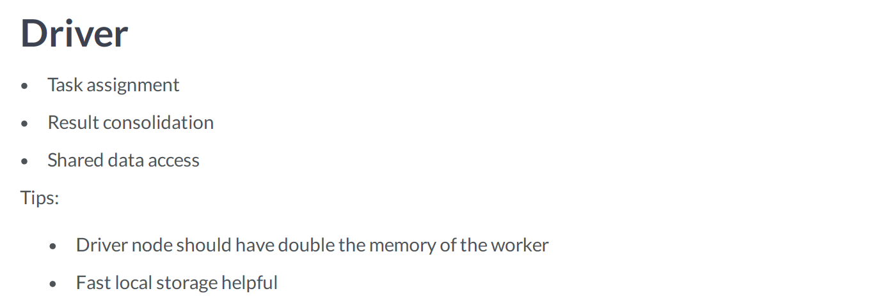
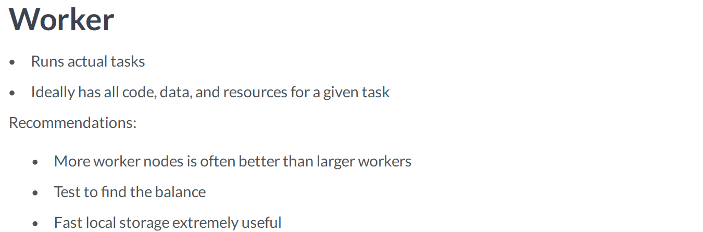

# DataFrame details
## Intro to data cleaning with Apache Spark
> Q: Why perform data cleaning with Spark?<br>
> A: Problem with typical data systems:
>   * Performance
>   * Organizing data flow

> Q: Advantages of Spark?<br>
> A: Scalable, powerful framework for data handling
>   * Spark offers high performance.
>   * Spark allows orderly data flows.
>   * Spark can use strictly defined schemas while ingesting data.

## Spark schemas
- Define the format of a dataframe
- May contain various data types: strings, dates, integers, arrays
- Can filter the garbage data during import
- Improves read performance



### Defining a schema
Creating a defined schema helps with data quality and import performance.

**_class_ `pyspark.sql.types.StructType(fields=None)`**<br>
> Struct type, consisting of a list of `StructField`.<br>
> This is the data type representing a Row.<br>
> Iterating a `StructType` will iterate its `StructField`s. A contained
`StructField` can be accessed by name or position.

**_class_ `pyspark.sql.types.StructField(name, dataType, nullable=True, metadata=None)`**<br>
> A field in `StructType`.
>
> Parameters:<br>
>   * `name` – string, name of the field.
>   * `dataType` – DataType of the field.
>   * `nullable` – boolean, whether the field can be null (None) or not.
>   * `metadata` – a dict from string to simple type that can be toInternald to
JSON automatically.

```python
# Import the pyspark.sql.types library
import pyspark.sql.types

# Define a new schema using the StructType method
people_schema = StructType([
  # Define a StructField for each field
  StructField('name', StringType(), nullable=False),
  StructField('age', IntegerType(), nullable=False),
  StructField('city', StringType(), nullable=False)
])
```

More info: [`pyspark.sql.types module`][types]

## Immutability and lazy processing
### Lazy processing
Lazy processing operations will usually return in about the same amount of time
regardless of the actual quantity of data. Remember that this is due to Spark
not performing any transformations until an action is requested. 

```python
# Load the CSV file
aa_dfw_df = spark.read.format('csv').options(Header=True).load('AA_DFW_2018.csv.gz')

# Add the airport column using the F.lower() method
aa_dfw_df = aa_dfw_df.withColumn('airport', F.lower(aa_dfw_df['Destination Airport']))

# Drop the Destination Airport column
aa_dfw_df = aa_dfw_df.drop(aa_dfw_df['Destination Airport'])

# Show the DataFrame
aa_dfw_df.show()
```

## Understanding Parquet
### The parquet format


### Working with parquet


### Parquet and SQL
The `Parquet` format is a columnar data store, allowing Spark to use predicate
pushdown. This means Spark will only process the data necessary to complete the
operations you define versus reading the entire dataset. This gives Spark more
flexibility in accessing the data and often drastically improves performance on
large datasets. 



# Manipulating DataFrames in the real world 
## Filtering column content with Python
```python
# Show the distinct VOTER_NAME entries
voter_df.select('VOTER_NAME').distinct().show(40, truncate=False)

# Filter voter_df where the VOTER_NAME is 1-20 characters in length
voter_df = voter_df.filter('length(VOTER_NAME) > 0 and length(VOTER_NAME) < 20')

# Filter out voter_df where the VOTER_NAME contains an underscore
voter_df = voter_df.filter(~ F.col('VOTER_NAME').contains('_'))

# Show the distinct VOTER_NAME entries again
voter_df.select('VOTER_NAME').distinct().show(40, truncate=False)

# Count the number of rows beginning with '#'
comment_count = annotations_df.where(col('_c0').startswith('#')).count()
comment_count = annotations_df.filter(col('_c0').startswith('#')).count()
```

## Modifying DataFrame columns
**`pyspark.sql.functions.split(str, pattern)`**<br>
> Splits str around pattern (pattern is a regular expression).

**`getItem(key)`**<br>
> An expression that gets an item at position ordinal out of a list, or gets an
item by key out of a dict.

**`pyspark.sql.functions.size(col)`**<br>
> Collection function: returns the length of the array or map stored in the
column.<br>
> Parameters:<br>
> `col` – name of column or expression

```python
# Add a new column called splits separated on whitespace
voter_df = voter_df.withColumn('splits', F.split(voter_df.VOTER_NAME, '\s+'))

# Create a new column called first_name based on the first item in splits
voter_df = voter_df.withColumn('first_name', voter_df.splits.getItem(0))

# Get the last entry of the splits list and create a column called last_name
voter_df = voter_df.withColumn('last_name', voter_df.splits.getItem(F.size('splits') - 1))

# Drop the splits column
voter_df = voter_df.drop('splits')
```

## Conditional DataFrame column operations
- `.when(<if condition>, <then x>)`: lets you conditionally modify a Data Frame
based on its content.
- `.otherwise()` is like `else`

```python
# method 1
df.select(df.Name, df.Age,
          .when(df.Age >= 18, "Adult")
          .when(df.Age < 18, "Minor"))
# method 2
df.select(df.Name, df.Age,
          .when(df.Age >= 18, "Adult")
          .otherwise("Minor"))
```

```python
# Add a column to voter_df for a voter based on their position
voter_df = voter_df.withColumn('random_val',
                               when(voter_df.TITLE == 'Councilmember', F.rand())
                               .when(voter_df.TITLE == 'Mayor', 2)
                               .otherwise(0))
```

## User defined functions

**`pyspark.sql.functions.udf(f=None, returnType=StringType)`**<br>
> Creates a user defined function (UDF).<br>
>
> Parameters:<br>
>   * `f` – python function if used as a standalone function
>   * `returnType` – the return type of the user-defined function. The value
can be either a `pyspark.sql.types.DataType` object or a DDL-formatted type
string.



## Partitioning and lazy processing
```python
# Select all the unique council voters
voter_df = df.select(df["VOTER NAME"]).distinct()

# Count the rows in voter_df
print("\nThere are %d rows in the voter_df DataFrame.\n" % voter_df.count())

# Add a ROW_ID
voter_df = voter_df.withColumn('ROW_ID', F.monotonically_increasing_id())

# Show the rows with 10 highest IDs in the set
voter_df.orderBy(voter_df.ROW_ID.desc()).show(10)
```

To check the number of partitions, use the method `.rdd.getNumPartitions()`
on a DataFrame.

# Improving Performance
## Caching
> Q: What is caching?<br>
> A: Caching in Spark:
>   * Stores DataFrames in memory or on disk
>   * Improves speed on later transformations / actions
>   * Reduces resource usage

> Q: Disadvantages of caching<br>
>   * Very large data sets may not fit in memory
>   * Local disk based caching may not be a performance improvement
>   * Cached objects may not be available

Call `.cache()` on the DataFrame before Action:
```python
voter_df = voter_df.withColumn('ID', monotonically_increasing_id())
voter_df = voter_df.cache()
```

Check `.is_cached` to determine cache status:
```python
voter_df.is_cached
```

Call `.unpersist()` when finished with DataFrame:
```python
voter_df.unpersist()
```

## Improve import performance
Spark Clusters are made of two types of processes
- Driver process
- Worker processes

Important parameters:
- Number of objects (Files, Network locations, etc)
  * More objects better than larger ones
  * Can import via wildcard<br>
  `airport_df = spark.read.csv('airports-*.txt.gz')`
- General size of objects
  * Spark performs better if objects are of similar size

A well-de ned schema will drastically improve import performance
- Avoids reading the data multiple times
- Provides validation on import

## Cluster configurations



```python
# Check the name of the Spark application instance ('spark.app.name')
app_name = spark.conf.get('spark.app.name')

# Determine the TCP port the driver runs on ('spark.driver.port')
driver_tcp_port = spark.conf.get('spark.driver.port')

# Determine how many partitions are configured for joins
num_partitions = spark.conf.get('spark.sql.shuffle.partitions')
```

```python
# Store the number of partitions in variable
before = departures_df.rdd.getNumPartitions()

# Configure Spark to use 500 partitions
spark.conf.set('spark.sql.shuffle.partitions', 500)

# Recreate the DataFrame using the departures data file
departures_df = spark.read.csv('departures.txt.gz').distinct()

# Print the number of partitions for each instance
print("Partition count before change: %d" % before)
print("Partition count after change: %d" % departures_df.rdd.getNumPartitions())
```

## Performance improvements
> Q: What is shuffling?<br>
> A: Shuffling refers to moving data around to various workers to complete a task
>   * Hides complexity from the user
>   * Can be slow to complete
>   * Lowers overall throughput
>   * Is often necessary, but try to minimize

> Q: How to limit shuffling?<br>
> A:
>   * Limit use of `.repartition(num_partitions)`
>   * Use `.coalesce(num_partitions)` instead
>   * Use care when calling `.join()`
>   * Use `.broadcast()`
>   * May not need to limit it

**`repartition(numPartitions, *cols)`**<br>
> Returns a new DataFrame partitioned by the given partitioning expressions. The
resulting DataFrame is hash partitioned.<br>
> Parameters:<br>
> `numPartitions` – can be an int to specify the target number of partitions or
a Column. If it is a Column, it will be used as the first partitioning column.
If not specified, the default number of partitions is used.

**`pyspark.sql.functions.coalesce(*cols)`**<br>
> Returns the first column that is not null.

**`pyspark.sql.functions.broadcast(df)`**<br>
> Marks a DataFrame as small enough for use in broadcast joins.

### Using broadcasting on Spark joins
- Broadcast the smaller DataFrame. The larger the DataFrame, the more time
required to transfer to the worker nodes.
- On small DataFrames, it may be better skip broadcasting and let Spark figure
out any optimization on its own.
- If you look at the query execution plan, a broadcastHashJoin indicates you've
successfully configured broadcasting.

```python
from pyspark.sql.functions import broadcast

# Join the flights_df and airports_df DataFrames using broadcasting
broadcast_df = flights_df.join(broadcast(airports_df), \
    flights_df["Destination Airport"] == airports_df["IATA"] )
```

# Complex processing and data pipelines 
## Quick pipeline
```python
# Import the data to a DataFrame
departures_df = spark.read.csv('2015-departures.csv.gz', header=True)

# Remove any duration of 0
departures_df = departures_df.filter(departures_df['Actual elapsed time (Minutes)'] != 0)

# Add an ID column
departures_df = departures_df.withColumn('id', F.monotonically_increasing_id())

# Write the file out to JSON format
departures_df.write.json('output.json', mode='overwrite')
```

### Removing invalid rows
```python
# Split _c0 on the tab character and store the list in a variable
tmp_fields = F.split(annotations_df['_c0'], '\t')

# Create the colcount column on the DataFrame
annotations_df = annotations_df.withColumn('colcount', F.size(tmp_fields))

# Remove any rows containing fewer than 5 fields
annotations_df_filtered = annotations_df.filter(~ (annotations_df['colcount'] >= 5))

# Count the number of rows
final_count = annotations_df_filtered.count()
```

### Further parsing
```python
def retriever(cols, colcount):
  # Return a list of dog data
  return cols[4:colcount]

# Define the method as a UDF
udfRetriever = F.udf(retriever, ArrayType(StringType()))

# Create a new column using your UDF
split_df = split_df.withColumn('dog_list', udfRetriever(split_df.split_cols, split_df.colcount))

# Remove the original column, split_cols, and the colcount
split_df = split_df.drop('_c0').drop('colcount').drop('split_cols')
```

## Data validation
Validation is:
- Verifying that a dataset complies with the expected format
- Number of rows / columns
- Data types
- Complex validation rules

Validating via joins
- Compares data against known values
- Easy to  nd data in a given set
- Comparatively fast

```python
# Rename the column in valid_folders_df
valid_folders_df = valid_folders_df.withColumnRenamed('_c0', 'folder')

# Count the number of rows in split_df
split_count = split_df.count()

# Join the DataFrames
joined_df = split_df.join(F.broadcast(valid_folders_df), "folder")
```

```python
# Create a function to return the number and type of dogs as a tuple
def dogParse(doglist):
  dogs = []
  for dog in doglist:
    (breed, start_x, start_y, end_x, end_y) = dog.split(',')
    # dogs.append((str(breed), int(start_x), int(start_y), int(end_x), int(end_y)))
    dogs.append((breed, int(start_x), int(start_y), int(end_x), int(end_y)))
  return dogs

# Create a UDF
udfDogParse = F.udf(dogParse, ArrayType(DogType))

# Use the UDF to list of dogs and drop the old column
joined_df = joined_df.withColumn('dogs', udfDogParse('dog_list')).drop('dog_list')

# Show the number of dogs in the first 10 rows
joined_df.select(F.size('dogs')).show(10)
```

```python
# Define a UDF to determine the number of pixels per image
def dogPixelCount(doglist):
    totalpixels = 0
    for dog in doglist:
        totalpixels += (dog[3] - dog[1]) * (dog[4] - dog[2])
    return totalpixels

# Define a UDF for the pixel count
udfDogPixelCount = F.udf(dogPixelCount, IntegerType())
joined_df = joined_df.withColumn('dog_pixels', udfDogPixelCount(joined_df.dogs))

# Create a column representing the percentage of pixels
joined_df = joined_df.withColumn('dog_percent', (joined_df.dog_pixels / (joined_df.width * joined_df.height)) * 100)

# Show the first 10 annotations with more than 60% dog
joined_df.filter(joined_df.dog_percent > 60).show(10)
```

[types]: https://spark.apache.org/docs/latest/api/python/pyspark.sql.html?highlight=filter#module-pyspark.sql.types